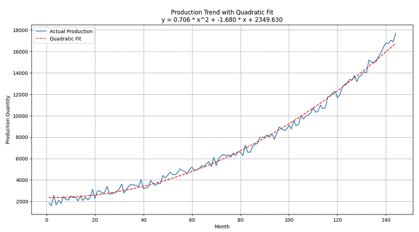

# 🏭 Production Forecasting & Warehouse Planning

 
 

  
  
<em>Figure: Forecasted Production vs Warehouse Capacity Threshold (2018–2030)</em>

---

## 📖 Overview
This project applies **mathematical modeling and numerical methods** to forecast EGIER’s monthly production capacity and plan for warehouse expansion.  

Main goals:
- 📈 Capture non-linear growth patterns in production.  
- 🏗 Predict when output will exceed **25,000 bag capacity**.  
- 🧮 Apply **quadratic regression**, **Taylor Series validation**, and **Newton-Raphson root finding**.  

---

## 🔑 Highlights

| Step | Methodology                  | Key Insight |
|------|-------------------------------|-------------|
| **Trend Fitting** | Quadratic polynomial regression | Nonlinear trends modeled accurately |
| **Series Check**  | Taylor expansion (2nd order)   | Polynomial confirmed as exact match |
| **Threshold Point** | Newton-Raphson iteration     | Capacity exceeded at **Month 180** |
| **Planning Buffer** | Backward adjustment (−13 mo) | Build warehouse at **Month 167** |

✔️ Both **Normal Equation** and **Pseudoinverse** approaches gave identical regression results.  
✔️ Forecasting tolerance achieved: **±0.015 error margin**. 
